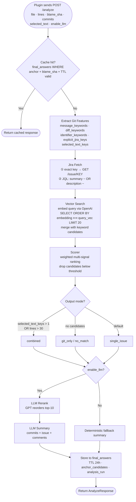
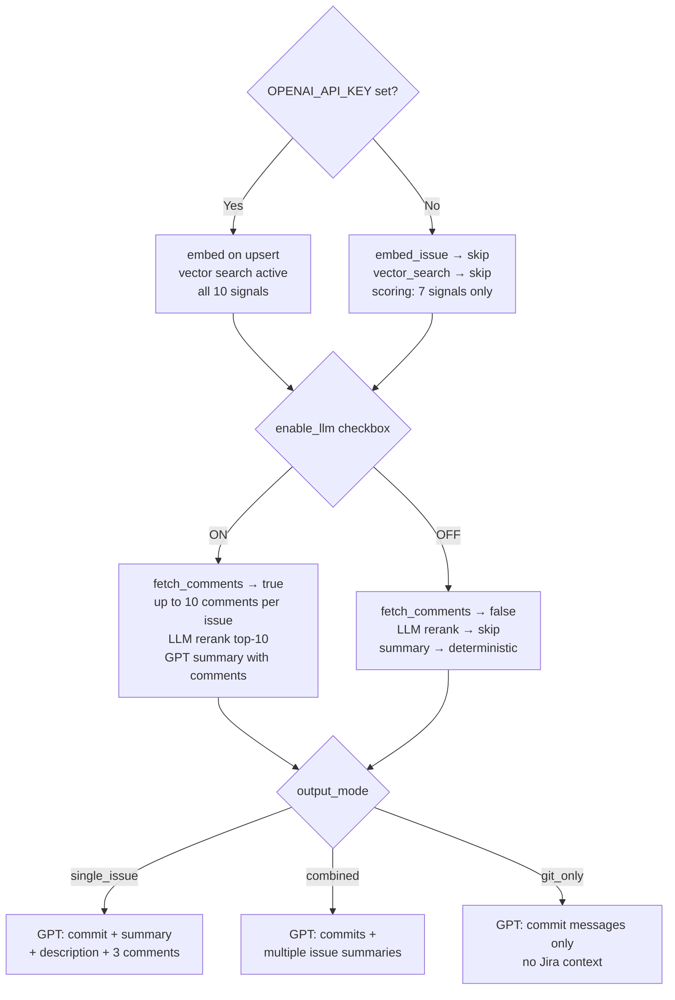

# WhyLine Backend Overview

## Analysis Pipeline

---

## Scorer Weights

| Signal | Weight | Source |
|---|---|---|
| Exact Jira key match | **100** | KAN-X found in commit msg / branch / selected text |
| Commit msg ↔ issue summary | **45** | Jaccard token overlap |
| Diff ↔ issue description | **35** | Jaccard token overlap |
| Diff ↔ issue comments | **35** | Jaccard token overlap |
| Vector similarity | **35** | cosine: `(1 − pgvector distance)` × weight |
| Identifiers ↔ summary+desc | **20** | file path · class · method name tokens |
| Time proximity | **20** | linear decay 0→1 over 0–180 days from commit date |
| Historical prior | **15** | issue seen before for this anchor |
| Project whitelist | **10** | project_key in allowed list |
| Labels overlap | **5** | identifier tokens ↔ issue labels |
| **Exact-key penalty** | **×0.5** | applied when semantic overlap < 0.05 despite key match |
| **Drop threshold** | **< 5** | candidates below this score are discarded |

---

## Feature Flags

